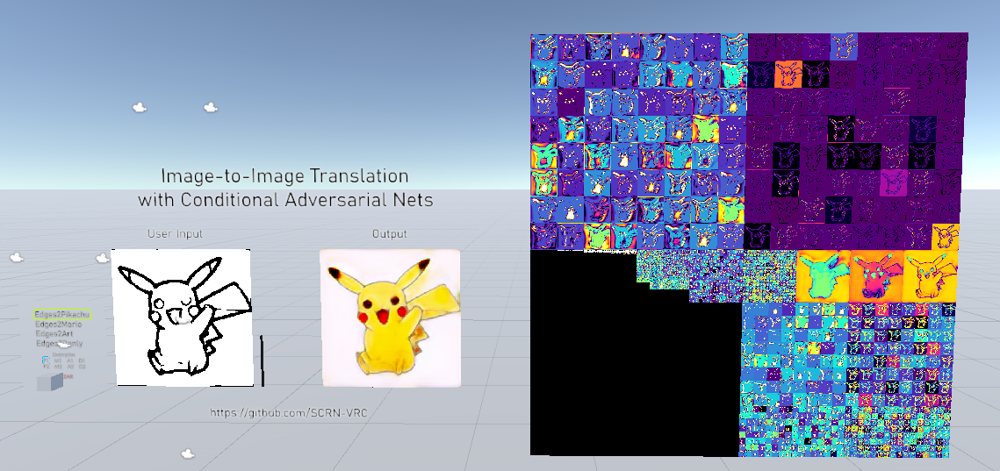
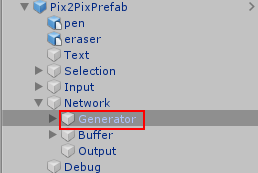
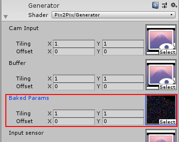

# Pix2Pix in a Shader

#### Fig. 1 - Basic network structure

#### Fig. 2 - Project setup in Unity

A simplified version of the pix2pix generator inside a fragment shader for Unity. This implementation is only 1/4 of the original pix2pix model to help with real time performance in VR.

## Overview
* Three version of pix2pix: Python, C++, HLSL
* Python + Keras version is the high level overview of the network structure, also does the offline training.
* C++ + OpenCV version is a low level version to help me convert the network into HLSL.
* HLSL version is the one used in-game in VRChat.
* Four pre-trained networks include: Edges2Pikachu, Edges2Mario, Edges2Tree, and Edges2Danly. All networks were trained from 100 to 200 epochs or 1 to 3 million iterations depending on the training size.

## Live Demo
* https://vrchat.com/home/launch?worldId=wrld_014d362b-164b-4b91-b628-a68f5ea0d5b7

## Setup for VRChat
#### Prerequisites
* [VRC SDK 2](https://vrchat.com/home/download) setup in a Unity project
* [VRChat layers must be setup already](https://docs.vrchat.com/docs/)

### Worlds
1. Clone the repository
2. Open the Unity project
3. Import VRCSDK2
4. Download the baked weights from https://mega.nz/file/N2BkAJoI#f65jOmX_wFiOjcnnFDX1qj_Gr6pZrG_LOGE4xl9vT44
5. Put WeightTex.asset inside \Assets\Pix2Pix\Weights\

6. Link WeightTex.asset to the "Baked Params" inside the Generator shader.

OR

1. Open a new Unity project
2. Import VRCSDK2
3. Import the Pix2Pix.unitypackage in [Releases](https://github.com/SCRN-VRC/Pix2Pix-in-a-Fragment-Shader/releases/)

## Python Code
If you wish to run the Python code, here's what you need.
* Anaconda 1.19.12
* Python 3.7
* TensorFlow 1.14.0
* Keras 2.3.1

I suggest following a guide on Keras + Anaconda installations like this one https://inmachineswetrust.com/posts/deep-learning-setup/

## C++ Code
If you wish to run the C++ code.
* [OpenCV – 4.0.1 or above](https://opencv.org/releases/)

You can follow a guide on OpenCV + Visual Studio here https://www.deciphertechnic.com/install-opencv-with-visual-studio/

If you have any questions or suggestions, you can find me on Discord: SCRN#8008
